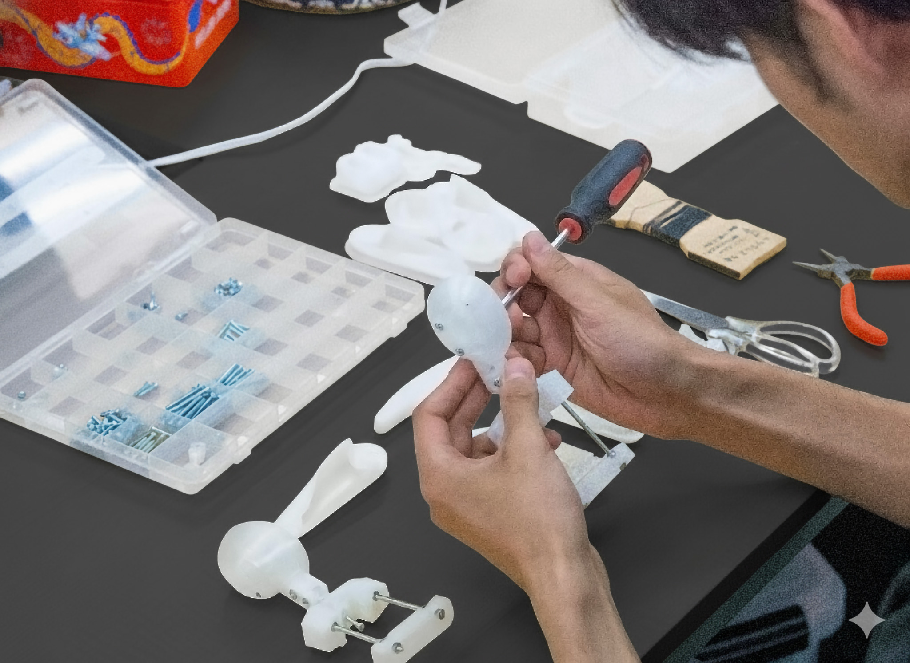

人形劇研究者による研究会で、人形劇に関する稲田の活動について話題提供として口頭発表をします。ご興味のある方に広くご参加いただけます。

稲田は2017年の筑波大学への入学を機に人形劇への関わりを始め、現在では大学での上演・制作はもとより、大学での研究や国際人形劇連盟日本センターを基軸とした普及や調査活動、業務としての専門劇団の制作にも携わりながら活動しています。情報学という専門領域を軸に、独特な切り口で取り組みを続けています。

## トピック

### 筑波大学人形劇団NEUについて

[人形劇団NEU](https://www.tkbneu.net/?utm_source=nandenjin.com&utm_medium=referral&utm_campaign=260521_announcement)（ノイ）は東京教育大学の児童文化研究部を前身とするサークルです。学生人形劇団としては珍しく、子ども向けの創作を前提とせず、自分たちが観て楽しめるものを作ることを目指して、人形劇や隣接分野の広い範囲で活動しています。近年では移動上演を積極的に行っており、職業人形劇団と同様に、依頼を受けて非舞台空間で出張上演ができるような体制を整えています。

稲田は2017年から現在まで所属しており、学生ならではの課題であるところの、ノウハウの継承が大変であること・指導者がおらず試行錯誤が多いこと・コストや作業時間の捻出に苦労すること、などの解決に取り組もうとしています。

<figure>
  
  <figcaption><a href="/works/yamaneko/">『注文の多い料理店』（2025）</a>より</figcaption>
</figure>

### 研究活動について

稲田は情報学（情報デザイン・メディアアートなど）を専門分野としていますが、ノイでの活動の影響もあって修士課程（2021〜）より人形劇をテーマに取り入れて研究活動を行っています。

近年掲げている課題は、「情報科学的な手法を使って、人形劇を観る人・取り組む人の幅を増やすことはできないか」というものです。このテーマのもと、デジタルファブリケーション（3Dプリント）を用いた人形劇の教育教材の開発や、人形劇活動のメタデータ整備を通じたアーカイブに取り組んでいます。また、これらの課題意識から派生する学外活動にも取り組んでいます。

## 参加のご案内

2026年5月21日（木）19:00-21:00 オンライン（Zoom Meetingsを利用）

参加をご希望の方は、[hello@nandenjin.comへお問い合わせください。](mailto:hello@nandenjin.com?subject=260521%20人形劇を広く知る会%20参加希望)
