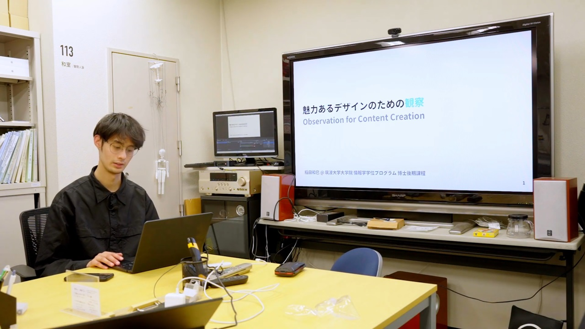
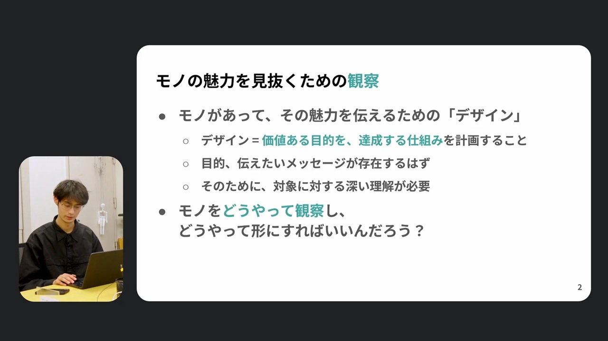
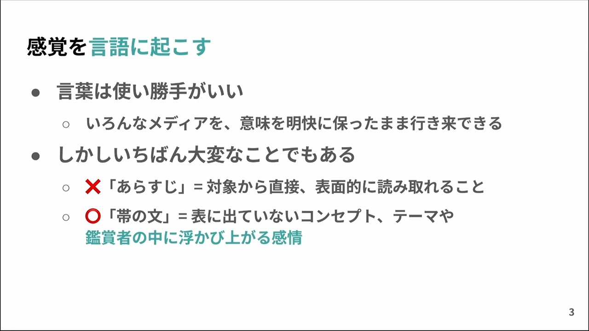
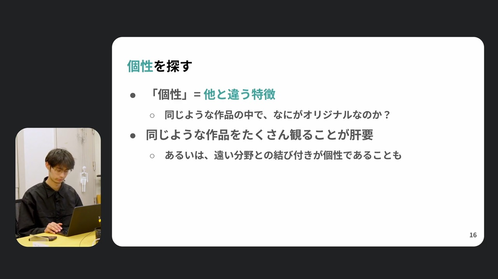
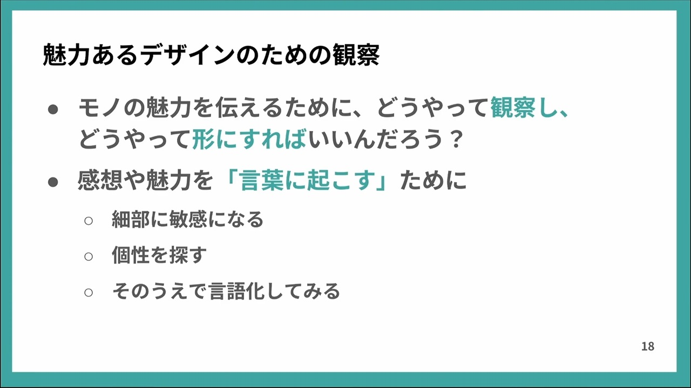

筑波大学 情報メディア創成学類の授業「情報デザインI」（2025）でのティーチング・フェロー活動について、筑波大学 人間総合科学学術院 TF優秀賞を受賞しました。これに伴い、学内FDプログラム（教職研修）での模擬授業を実施しましたので、その映像（オンデマンド配信）を公開いたします。

模擬授業では「魅力あるデザインのための観察」として、モノの魅力を伝えるための観察の方法を「好きな本や映画の一番良いところを、相手に届くように言葉にする」ことを題材に検討します。また付録として、情報メディア創成学類の授業でこの内容を扱うことの意義について、自身もその出身者である稲田の個人的な経験を交えて言及しています。

- [令和7年度 人間総合科学学術院・研究科 第4回FDプログラム](https://www.chs.tsukuba.ac.jp/fd/4347)
- 模擬授業「魅力あるデザインのための観察」
  - [📺️ オンデマンド映像](https://www.youtube.com/watch?v=M3mkpMWoiZU)
  - [💻️ スライド](https://docs.google.com/presentation/d/1GFvCB3FIt3LSgiZ5_7fKxCuurWGR1UqttInmqZfhQ8c/edit)
- [📖「魅力あるデザインのための観察」書き起こし記事](https://posts.nandenjin.com/2026/observation-for-attractive-design)

Inada received the TF Excellence Award from the University of Tsukuba's Faculty of Human and Environmental Studies for his activities as a Teaching Fellow in the course “Information Design I” (2025) within the Department of Information Media Creation. In connection with this, he conducted a mock class as part of the university's FD program (faculty development training). The video recording of this session (on-demand streaming) is now available.

In the lesson, he explores observation methods for conveying the appeal of objects under the theme “Observation for Compelling Design,” using the example of “putting into words the best parts of your favorite books or movies in a way that resonates with others.” Additionally, as an appendix, Inada (a graduate of the Information Media Creation program himself) discusses the significance of covering this content in the program's courses, drawing on his personal experience.

- [Faculty of Integrated Human Sciences AY2025 4th FD Program](https://www.chs.tsukuba.ac.jp/fd/4347)
- Mock Lecture: "Observation for Attractive Design"
  - [📺️ On-Demand Video](https://www.youtube.com/watch?v=M3mkpMWoiZU)
  - [💻️ Slides](https://docs.google.com/presentation/d/1GFvCB3FIt3LSgiZ5_7fKxCuurWGR1UqttInmqZfhQ8c/edit)
- [📖 "Observation for Attractive Design" article](https://posts.nandenjin.com/2026/observation-for-attractive-design)

