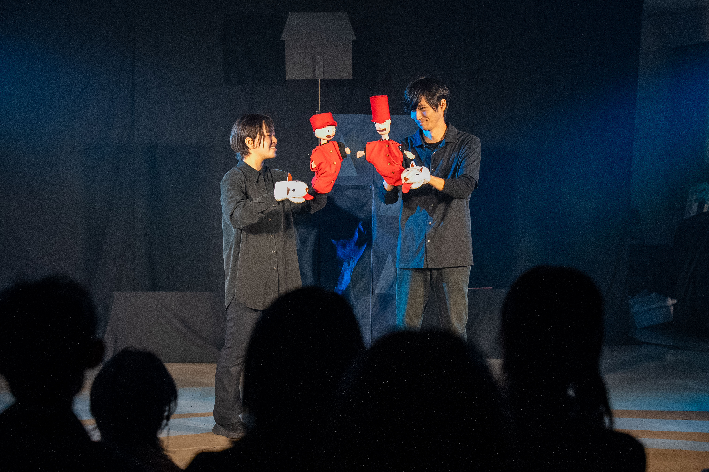
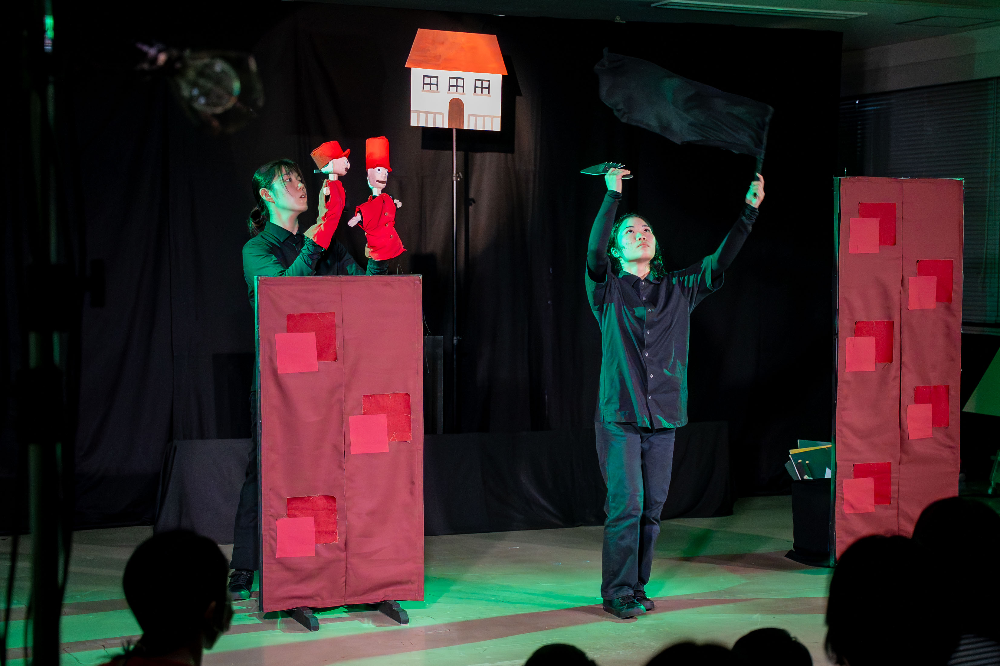
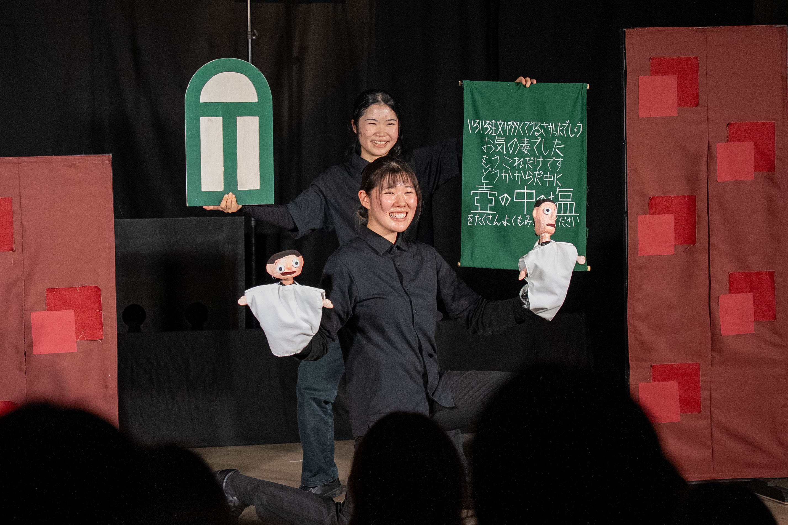
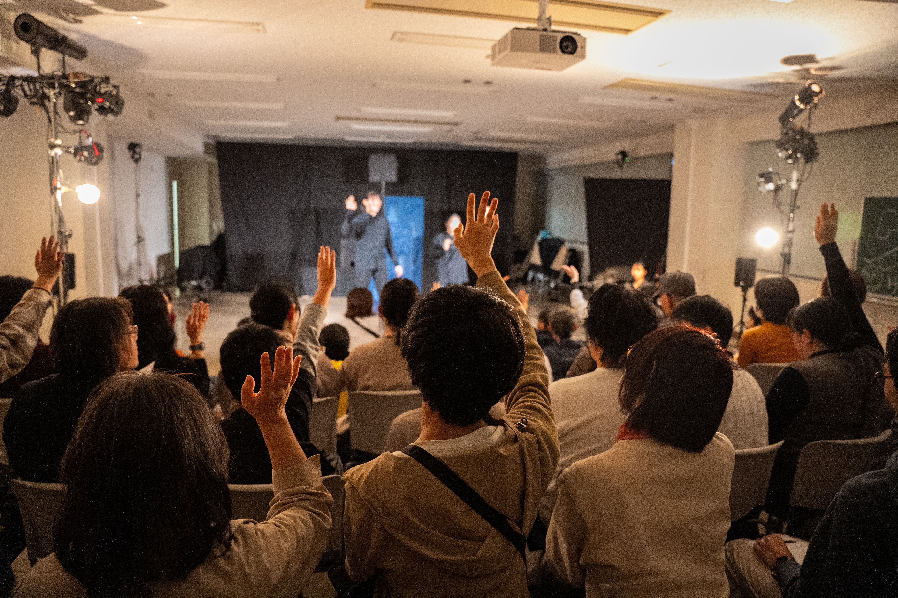
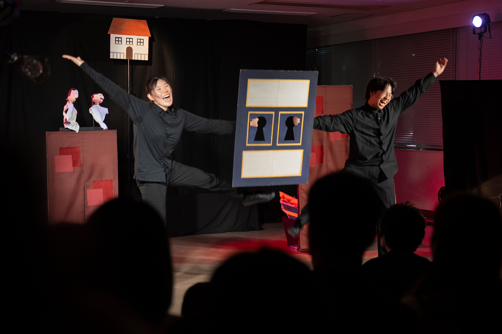
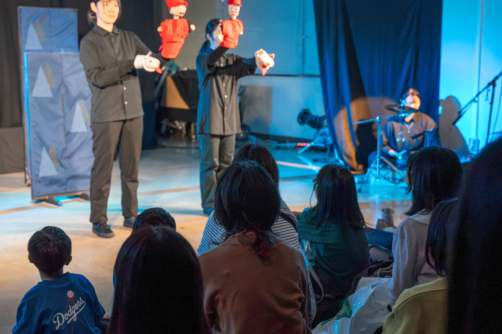

筑波大学人形劇団『注文の多い料理店』で、作品の企画を担当。

> 東京から来たふたりの紳士が山で迷い込んだのは、西洋料理店「山猫軒」。次々現れる「注文」をしていたのは、人間を食べようと待ち構える山猫だった！
>
> 誰もが知るであろう、宮沢賢治による『注文の多い料理店』。都会から来て狩りを楽しむ「紳士」と、腹を空かせて彼らを狙う「山猫」のストーリーには、都会文明への批判と、自然とともに生きることへのメッセージが込められているとされます。
>
> ものがたりが書かれてから100年あまり。ずっと便利に生活することができるようになった現代のわたしたちに、登場人物たちの姿はどう重なるのでしょうか。

- 原作: 宮沢賢治
- 演出: 田中咲妃・塚越彩加
- 音楽: 井嶋光里・磯貝美由紀
- 照明: 上條真菜
- 協力
  - 磯貝美由紀・植田涼太・武井優泰・齋藤玲緒・佐々木陽登・森田祥真・矢内草花・横井一葉（以上、人形劇団NEU）
  - 井上睦美・宇津木まひる・角田実優
- 企画: 稲田和巳

